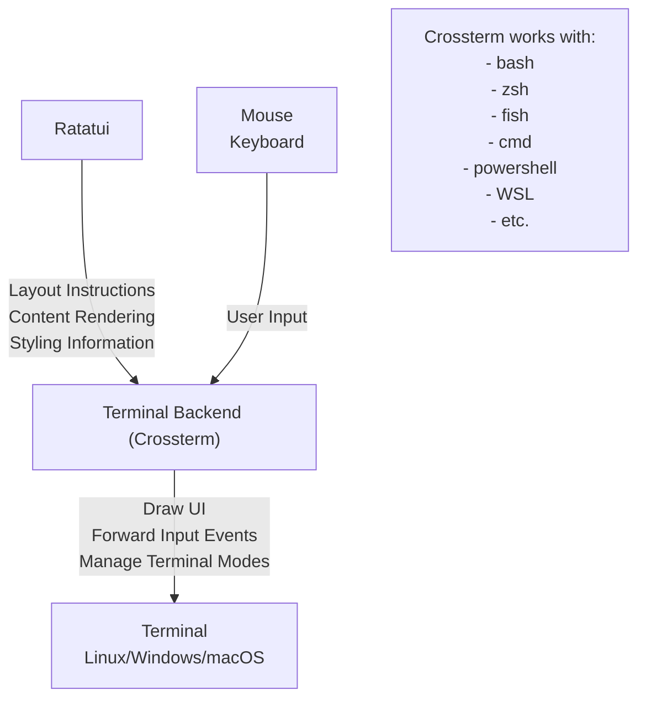
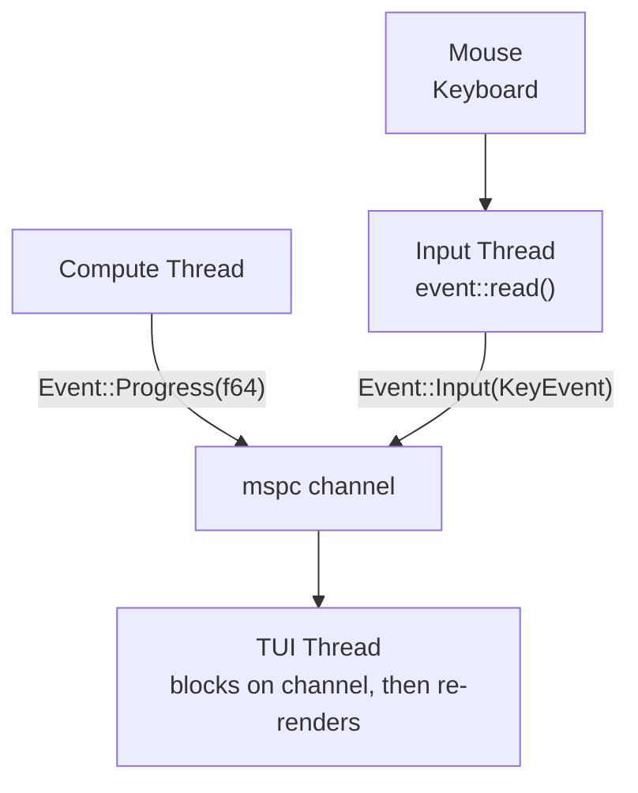
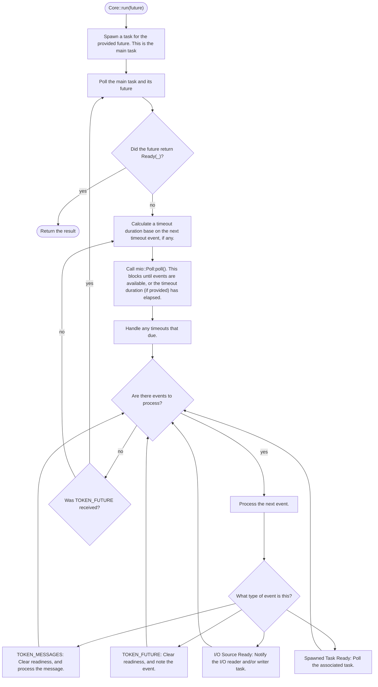

# Contributing

It's a Working in Progress project introduction, which include architectures and design patterns we used or not, and their reasons.

## Rust TUI Tutorial

[Rust TUI Tutorial: Ratatui, Multithreading, and Responsiveness - Youtube](https://www.youtube.com/watch?v=awX7DUp-r14)

### Ratatui Architecture



### Event Driven Architecture



- Advantages:
  - Re-renders only occurs when necessary
  - Better separation of concerns
- Disadvantages:
  - More complex implementation
  - Use of one additional thread

### With Async

```rust
use chrono::{DateTime, Utc};
use crossterm::event::{Event as CrosstermEvent, KeyCode, KeyEventKind};
use std::{process, time::Duration};
use tokio::sync::mpsc;

enum Message {
    Exit,
    Timer(DateTime<Utc>),
}

#[tokio::main]
async fn main() {
    let (tx, mut rx) = mpsc::channel(32);

    let first = tx.clone();
    let second = tx.clone();

    tokio::spawn(async move {
        loop {
            let crossterm_event = crossterm::event::read().unwrap();
            match crossterm_event {
                CrosstermEvent::Key(key) => {
                    if key.kind == KeyEventKind::Press {
                        match key.code {
                            KeyCode::Char('q') => first.send(Message::Exit).await.unwrap(),
                            KeyCode::Char(char) => println!("Key {char} Pressed"),
                            _ => println!("Other KeyPress"),
                        }
                    }
                }
                _ => println!("Other CrosstermEvent"),
            }
        }
    });

    tokio::spawn(async move {
        let mut interval = tokio::time::interval(Duration::from_secs(1));
        loop {
            interval.tick().await;
            second.send(Message::Timer(Utc::now())).await.unwrap();
        }
    });

    while let Some(message) = rx.recv().await {
        match message {
            Message::Timer(date_time) => println!("{date_time}"),
            Message::Exit => process::exit(0),
        }
    }
}
```

## Tokio

- [Tokio internals: Understanding Rust's asynchronous I/O framework from the bottom up](https://cafbit.com/post/tokio_internals)
- [【譯】Tokio 內部機制：從頭理解 Rust 非同步 I/O 框架](https://gist.github.com/ckaznable/80d1925e8ae88f1e9fd8eac70807b5d2)



## Learning Source

- [Rust 语言圣经](https://course.rs)
- [Rust 程序设计语言 简体中文版](https://kaisery.github.io/trpl-zh-cn)
