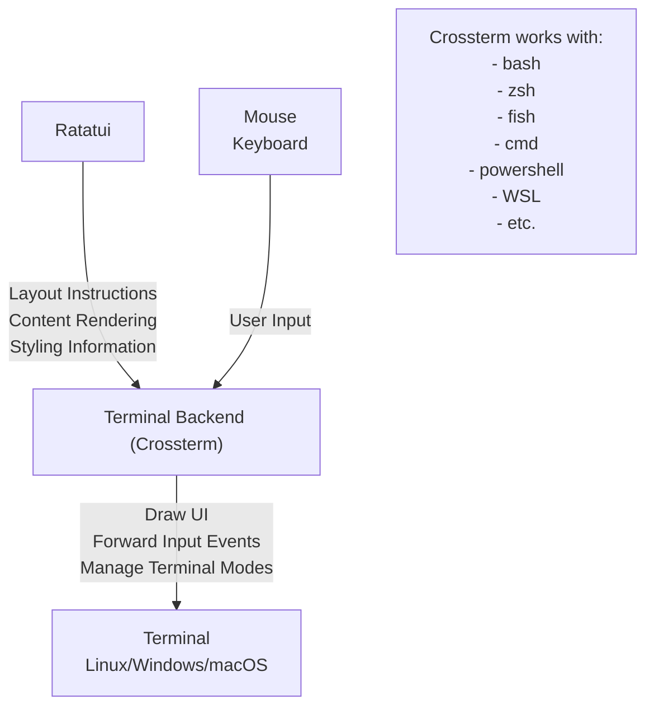
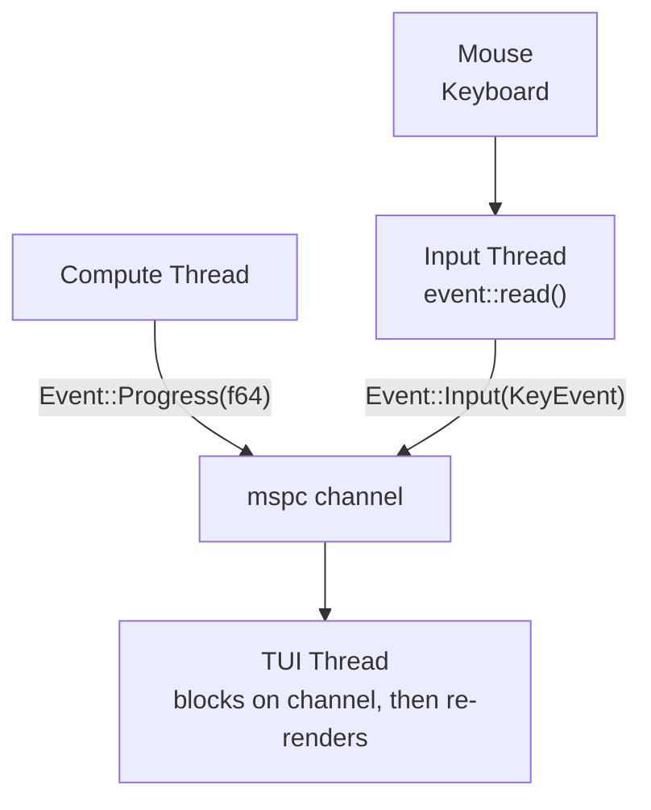

# Contributing

It's a Working in Progress project introduction, which include architectures and design patterns we used or not, and their reasons.

## Rust TUI Tutorial

[Rust TUI Tutorial: Ratatui, Multithreading, and Responsiveness - Youtube](https://www.youtube.com/watch?v=awX7DUp-r14)

### Ratatui Architecture

### Event Driven Architecture

- Advantages:
  - Re-renders only occurs when necessary
  - Better separation of concerns
- Disadvantages:
  - More complex implementation
  - Use of one additional thread
